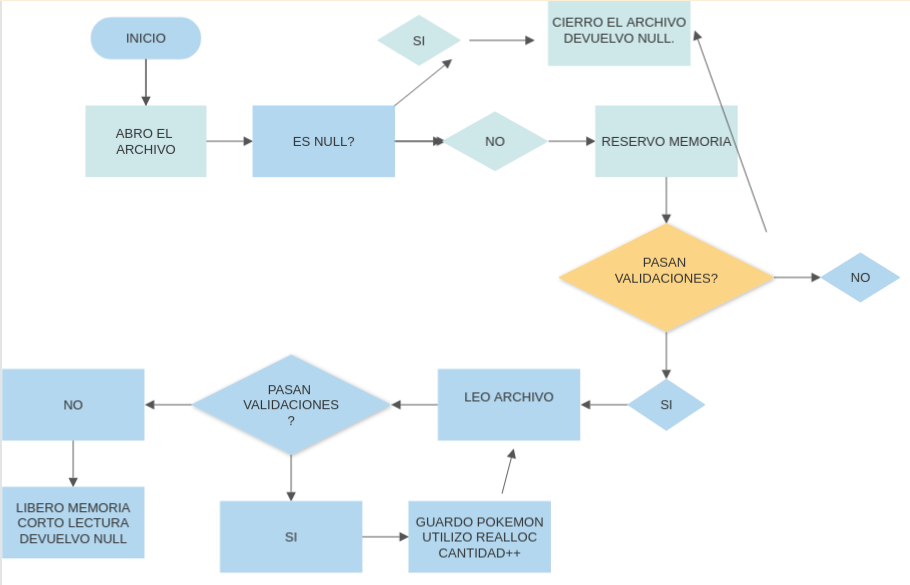
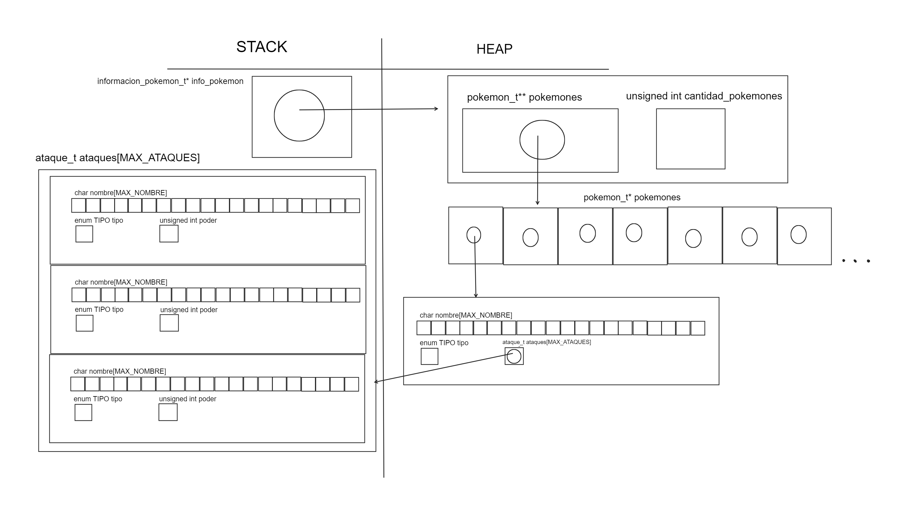

<div align="right">

</div>

# TP1

## Repositorio de Cristian Portolan - 110596 - cportolan@fi.uba.ar

- Para compilar:
gcc -std=c99 -Wall -Wconversion -Wtype-limits -pedantic -Werror -O2 -g src/pokemon.c -o src/pokemon


- Para ejecutar:
./src/pokemon 


- Para ejecutar con valgrind:
make valgrind-chanutron

---
##  Funcionamiento

El programa comienza abriendo un archivo por parametro, se realizan las validaciones correspondientes y luego se comienza a leer de a cuatro lineas, ya que cada Pokemon tiene cuatro lineas.
Cada vez que lee, se llaman a ciertas funciones (luego de aplicar validaciones) para parsear los datos leidos a los pokemones y a sus respectivos ataques, es decir, a sus estructuras. En el caso de que haya un error en las validaciones o que el archivo haya llegado a su fin, corta la lectura.

<div align="center">

</div>

En el archivo `pokemon.c` la funcion de firma `informacion_pokemon_t* pokemon_cargar_archivo(const char *path);` se utiliza calloc para reservar un bloqueo de memoria del tamaño informacion_t en el cual inicializamos (con el mismo calloc) para no tener problemas y poder trabajar en nuestra estructura de informacion. Ademas, al utilizar un vector dinamico, debemos utilizar `realloc` para ir agrandando el bloque de memoria reservado a medida que vamos agregando pokemones, ya que no sabemos cuantos pokemones vamos a tener que agregar, por lo tanto se debe ir aumentando la cantidad de pokemones existentes y el bloque de memoria.

```c
informacion_pokemon_t* informacion = calloc(1, sizeof(informacion_pokemon_t));
informacion->pokemones = realloc(informacion->pokemones, (1 + informacion->cantidad_pokemones)*(sizeof(pokemon_t)));
```

<div align="center">

</div>

Ademas, cree una funcion con firma `pokemon_t* leer_pokemon(char l1[MAX_LINEA], char l2[MAX_LINEA], char l3[MAX_LINEA], char l4[MAX_LINEA])` la cual luego de realizar mi fscanf y almacenar las cuatro lineas, lo que hace es llamar dentro a `parsear_pokemon` y a `parsear_ataque` para poder asignarle a mi `pokemon_t* p` el cual le asigno un bloque de memoria con calloc (para poder inicializar todo en cero) y luego devuelvo ese mismo pokemon para poder asignarlo a mi struct de informacion_pokemon_t.

Para realizar las validaciones sobre las lineas leidas, cree funciones booleanas para verificar que cada linea tenga su respectiva cantidad de delimitadores, que en este caso eran ';', ademas valide que el tipo de pokemon o de ataque sea el correcto, que el poder sea un numero entero positivo, y demas. 

Por ultimo, tenemos nuestra funcion de firma `void pokemon_destruir_todo(informacion_pokemon_t *ip);` que al finalizar el programa se encarga de liberar toda la memoria reservada en el heap que fue utilizada. Lo que hace es recorrer todo mi struct de informacion, y va accediendo a campo por campo para liberar esa memoria.

```c
if(ip) {
	for(int i = 0; i < ip->cantidad_pokemones; i++)
		free(ip->pokemones[i]);
		
	free(ip->pokemones);
	free(ip);
}
```
---

## Respuestas a las preguntas teóricas

- Explicar cómo se logra que los pokemon queden ordenados alfabéticamente y cuál es el costo computacional de esta operación.

Para ordenar mis pokemones utilice el Bubble Sort, teniendo en cuenta los nombres de los pokemones (todas las letras). Para esto realice un 'strcmp', y dependiendo el resultado, se intercambiaba la posicion de mis pokemones. 

Si hablamos de complejidad computacional, podemos ver que en el ordenamiento por burbujeo se realizan dos for, de esta manera:

for(int i = 0; i < tope -1; i++) {
	for(int j = 0; j < tope - i - 1) {
		...
	}
}

Entonces podemos determinar que estamos haciendo n iteraciones con el iterador j, por cada iteracion de i, entonces segun la notacion BIG O, seria O(NxN) => O(N^2).


